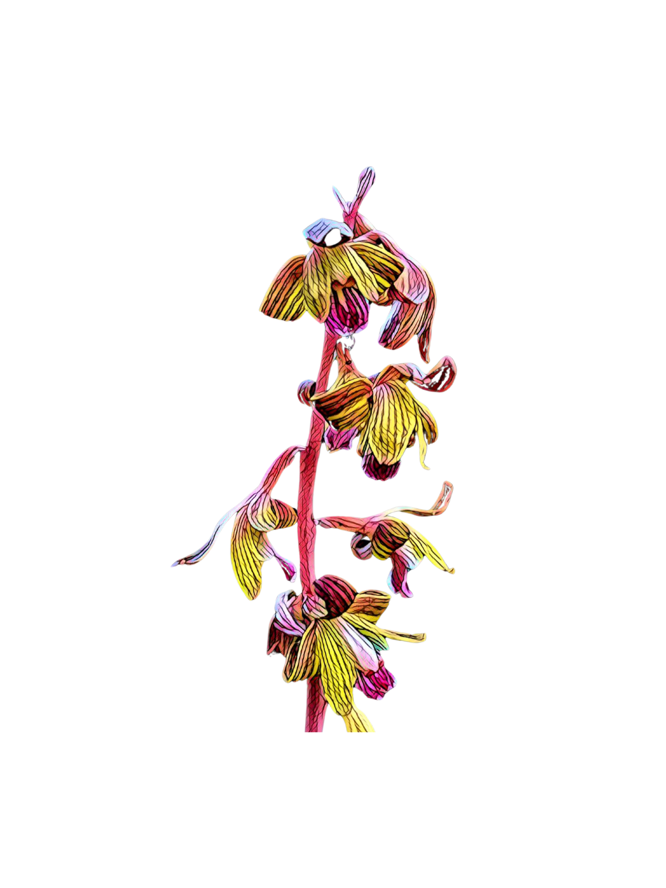

# Flower Hunting with iNaturalist: a BrainStation Capstone
<h1 align="center">

</h1> 

## Personal Connection
I've always been interested in plant identification and generally knew a few more things about the kinds of plants that might pop up in the sidewalk cracks in my neighborhood than the average person. When 2020 hit and quarantine shut down everywhere except my apartment and nature trails, I ended up spending a lot of time in my apartment and on nature trails. A good google search might help me learn the name of one new plant each week, but when a good friend introduced me to iNaturalist, my knowledge base took off. The AI helped suggest a solid genus name for the plants I was taking pictures of and then other iNaturalist users would come along to help refine identifications at the species level. I spent an hour each day taking pictures along a hike, another 20 minutes uploading them and guessing their identity that night and another hour looking through the observations other users posted for my area during that same day--agreeing or disagreeing with their identifications if I knew enough about the plant to feel sure of myself. If a user posted a flower I'd never seen before, I'd use the geolocation and the AllTrails app to find a nature trail that could take me to the plant on the next day so I could see it for myself. Until someone posted a Crested Coralroot Orchid. That picture's geolocation was obscured because the plant was vulnerable in the area. I backchanneled the user who posted it asking if he'd share the location. He vetted me and once he felt sure I wasn't a poacher, he shared the latitude and longitude with me, which is how I got my own picture of Bletia spicata. (Above is a stylized version of that picture). I've been a contributing member of the iNaturalist community ever since and specifically interested in how iNaturalist sits in a difficult position between building affinity for and collecting data toward the conservation of the natural world while also potentially exposing vulnerable species to misuse or possible poaching. Now that I am pursuing a degree in Data Science through BrainStation's bootcamp, I am thrilled to have new skills to apply to an old love--exploring this ethical crossroads with greater depth through the application of Data Science. 

## Context: But officially...what is iNaturalist? 
iNaturalist is a [“crowdsourced species identification system and an organism occurrence recording tool”](https://www.inaturalist.org/pages/about). It allows individual users to upload geolocated and timestamped observations of the natural living world (usually as pictures), allows the user to classify the observation up to the species level (with suggested help from an AI tool), and allows other users to verify or disagree with the user's classification. [iNaturalist allows users to personally obscure the geolocation of observations for privacy reasons and also automatically obscures the geolocation of any species identified as “at-risk”](https://www.inaturalist.org/pages/help#geoprivacy). However, the tool does not obscure the locations of other observations by the same user made near the same time, making it possible for poachers to use iNaturalist data to track down at-risk species through interpolation. 

## Questions:
1. What can machine learning tell us about the best practices for obscuring the geolocation of at-risk plants and the geolocation or other information of those observations made near it in time by the same user?

2. Subquestions:
   - Given a set of geolocated and timestamped observations of the natural world by the same user, can machine learning accurately predict the geolocation of one of the observation posted near the others in time when its geolocation is withheld?
   - How does a data cluster's looseness or tightness of geolocation and timestamp impact the accuracy of the prediction?
   - For a given clustering of geolocation and timestamp, how does number of observations impact the accuracy of the prediction?
   - What other variables might be correlated to prediction of geolocation?
   - What is a recommended set of data that, if withheld, would better protect the location of an observation with restricted geoprivacy?

## Impact
Data on the poaching of plants is difficult to obtain although [the United Nations Conference on Trade and Development speculates a rise in poaching by looking at discrepancies between declared exports and imports](https://unctad.org/press-material/illegal-trade-accelerates-wild-plant-extinctions-more-transparency-needed). Additionally, there is not currently data accessible that tackles the questions: “Does iNaturalist make endangered species more or less vulnerable? And if so, in what ways and by how much?” (Although this would be an interesting place for research). However, as a nonprofit organization with a goal of conservation, iNaturalist recognizes the need to protect at-risk plants from poachers and acknowledges this particular problem of interpolation: [“We are working on structural changes to make interpolating locations more difficult, but in the meantime we recommend not posting any open observations nearby in space and time to where your obscured observation was posted”](https://www.inaturalist.org/pages/help#geoprivacy). So my project has the potential to offer helpful insights and guidance toward this goal that iNaturalist has already identified but for which iNaturalist hasn’t yet produced a solution. It should be noted as well that my project could have potentially negative impact if poachers gained access to it. This means that I am striking an ethical balance here, with the assumption that those who will be looking at this project will be peers and educators in data science or potential employers who would not be interested or willing to share this information beyond that. For that reason, *I am asking that this project not be shared broadly but on a case-by-case basis, keeping the protection of endangered species as an important value when choosing with whom to share, when and why.*

## Methodology
1) __Data Collection__ \
   a) *General*: iNaturalist has [an export tool](https://www.inaturalist.org/observations/export) for its data that works by creating queries of 200,000 or fewer observations at a single time. To access the tool, one needs an iNaturalist account which is free to create. While the technical limit is 200,000 or fewer observations, I have found that making queries near that threshold usually fail while queries of 100,000 or fewer entries usually succeed, although it should be noted that queries of more than 2000 - 3000 observations can still take quite a long time to load. The export website states that large requests slow down their infrastructure, making it harder to release new changes and suggest other sources if they meet the needs. Since my questions are specific to how iNaturalist uses data, it was necessary to use the iNaturalist database, however other readers might consider the alternatives offered on the export page depending on their own needs to keep the load lighter on iNaturalist's infrastructure. \
   \
   b) *Preliminary Exploration*: My first exploratory sets involved downloading two sets of top-posting users "gregtasney" and "evanaturalist" to get a sense of the columns of data, potential methodology and cleaning concerns. I have three Jupyter notebooks that work with these two datasets. The "prelim_exploration" notebooks are kept in the github mostly as documentation and I tried my best to summarize and include any findings from those in the Spicata notebooks where the bulk of my analysis is applied. The third notebook was an initial mock-up of a potential interpolation modeling process and analysis and will be applied in future notebooks to the Spicata dataset. \
   \
   c) *Ungberg dataset*: I wanted to ensure I had a sense of how a vulnerable species marked for conservation protection might appear in both iNaturalist search engines and datasets, so I focused on the Crested Coralroot Orchid, whose location I actually knew. I used the iNaturalist search engine to see how the data was displayed on their own page through a browser if I searched for Bletia spicata in my area: 6 observers with 8 observations from July 2016 to July 2022. The locations were obscured to a distance of up to about 27 km away and the times given were granularized to the month and year rather than date and time. I chose one of the 8 observations--ungberg in July 2020--and downloaded all of that user's data from that month to see what the data looked like on the backend. I did not explore via a Jupyter notebook, but in looking through the csv, it does not seem as though data requested through the export obscures the timestamps and even if it was obscuring the "time_observed_at" category, the id numbers for each observation seem to created with respect to the "time_created_by" function, which gives a potential category for ordering the data by proximity in time regardless unless the user intentionally uploads the observation at a much later time (which some users do for vulnerable plants). \
   \
   d) *Spicata dataset*: If someone is trying to find a vulnerable species, they would first start with a search of the species itself and then narrow down the set of users who have posted about those vulnerable plants--users whose personal dataset have "clues" as to where the location of the vulnerable plant is, even if the plant's location is publicly obscured. I can't train and test on an actual vulnerable species because I don't have access to location data that can validate how accurate my models' location predictions are. But I can choose a non-vulnerable target species that shares some characteristics with vulnerable species. I thought of Lobelia inflata because I'm fond of it but in this area it is more rare than other native species. When I ran it through the iNaturalist search engine, on a national level, it had 11,500+ observations. Comparatively, vulnerable species like Yellow Lady's Slipper or Spring Ladies' Tresses only had 4,000 - 5,000 U.S. observations. However, inflata's cousin--Lobelia spicata--only had 4,500 U.S. observations, but was not listed as needing conservation protection, which meant its taxon geoprivacy settings would not obscure the location data, making it a comparable species to study while still providing validation data. (I want to note here that I did not consciously know that the Crested Coralroot Orchid's species level name was the same as the target species I eventually landed on, but I am too far down the road of analysis to change it now and leave it here as evidence of unintentional human bias, which is, at least here, bias towards things I adore--certainly not the worst kind of bias we encounter in the world of data science. I hope my other motivations for choosing Lobelia spicata will protect the analysis from too much skew due to this unconscious affinity for the name spicata, but would also welcome and accept any study proving that I am wrong about this.) In the Spicata_Clean_and_Prep notebook, I downloaded the set of all Lobelia spicata observations in the U.S., identified the set of unique users whose spicata observations had locations listed at a research-grade level of positional accuracy and then used random shuffle functions on that set of users to choose sets of users to query from the iNaturalist database in groups of 10 until I reached at least 100,000 observations AND at least 100 Lobelia spicata observations. This took 70 users to accomplish. Once that set was constructed, I cleaned the data and downloaded the csv for future use for EDA and modeling. (See "Description of Dataset" below.\
3) __EDA__
4) __Initial Modeling: Linear Interpolation__\
   Split the Lobelia spicata set into train and test data. For each observation in the training data: a) identify the user for that spicata observation b) locate up to 100 observations by that user--50 directly before, 50 directly after--based off the time_observed_at column c) use linear interpolation as mapped out in the mock-up to predict the location and record its accuracy and also answer the question: how many observation locations would need to be obscured to protect this location at a given standard? d) collect information about the accuracy as well as the answer to second question into meta-datasets. e) compare their spread to the spread for the test data. What do the distributions have to tell us about the answers to initial questions?\
5) __Further Modeling__\
   What other kinds of modeling might be leveraged to gain access to the location of obscured species? What kinds of measures do these models suggest we take to protect the location?

## Description of Dataset
  For construction of this dataset, see *Spicata dataset* above. Below are the columns of data I found relevant for EDA and modeling for the first round of initial modeling. Future rounds may pull in other columns available via iNaturalist.
  - __id__: int of unique id of species, appears to be assigned at upload, generated consecutively in time and therefore directly correlated to the "created_at" column
  - __time_observed_at__: timestamp of when the observation was made given in UTC time *technically needs to be converted from object to timestamp*
  - __user_id__: int of unique numerical id of user, appears to be assigned when account is created, generated consecutively in time and therefore small numbers point to early adopters
  - __created_at__: timestamp of when the observation was uploaded to iNaturalist given in UTC time *technically needs to be converted from object to timestamp*
  - __quality_grade__: string, "research" indicates at least two users agree on the species level AND more than half of the user ids for this observation are in agreement; "needs_id" if the observation contains all the necessary information required to make "research grade" but is missing the needed ratio of user identifications; "casual" means it is missing important data components and cannot be used for "research grade". *This columns needs to be hot-encoded*
  - __num_identification_agreements__: int, I *think* that this refers to the number of users who agree on the final id of the observation. HOWEVER, it *could mean* number of identifications that agree with the original id chosen by the user. *To be sure would require more cross-check research.*
  - __num_identification_disagreements__: int, The same question as above, but records the disagreements rather than agreements.
  - __captive_cultivated__: boolean, [further information here](https://www.inaturalist.org/pages/help#:~:text=Quality%20Assessment%20section.-,What%20does%20captive%20%2F%20cultivated%20mean%3F,to%20be%20then%20and%20there.)
  - __latitude__: float, latitude of the observation--it is my deduction that this is associated with the public_positional_accuracy
  - __longitude__: float, see above
  - __positional_accuracy__: float, distance in meters, it is my deduction that this is associated with private lat/lon coordinates that are not available in this dataset or publicly--the accuracy of the posting, before geoprivacy is applied. [See here for more information](https://www.inaturalist.org/posts/2035-observation-location-accuracy)
  - __public_postitional_accuracy__: float, distance in meters--it is my deduction that this is the accuracy of the given "latitude" and "longitude" available in this dataset. See "positional_accuracy" for more information
  - __geoprivacy__: converted to boolean--either "obscured" or not, it is my deduction that this is in reference to a user's personal choice to make an observation obscured or not *name of this category should be changed for clarity*
  - __coordinates_obscured__: boolean--requires more exploration, but likely an umbrella category for both geoprivacy and taxon_geoprivacy
  - __species_guess__: string, the guess, if given, of the species when the id was made
  - __scientific_name__: string, the scientific name of the most granular taxon level at which the observation was identified without contradiction
  - __common_name__: string, a "common" translation of the scientific name
  - __taxon_genus_name__: string, the genus of the observation if identified at this level
  - __taxon_species_name__: string, the species of the observation if identified at this level
  - __obscured__: boolean, dummy variable from taxon_geoprivacy; 1 means the observation was obscured due to its taxon--likely a conservation reason *name of this category should be changed for clarity*
  - __open__: boolean, dummy variable from taxon_geoprivacy; 1 means the observation was open *name of this category should be changed for clarity*
  - __Animalia__: boolean, dummy from taxon_kingdom_name, 1 means the observation was identified to be part of the animal kingdom
  - __Fungi__: boolean, dummy from taxon_kingdom_name, 1 means the observation was identified to be part of the fungi kingdom
  - __Plantae__: boolean, dummy from taxon_kingdom_name, 1 means the observation was identified to be part of the plant kingdom
  - __minute_diff__: float, number of minutes between previous observation and this one when observations sorted by user and then time_observed_at. Initial observations for each user assigned the value -0.001
  - __km_diff__: float, number of km between previous observation and this one when observations sorted by user and then time_observed_at. Initial observations for each user assigned the value -0.001
   

